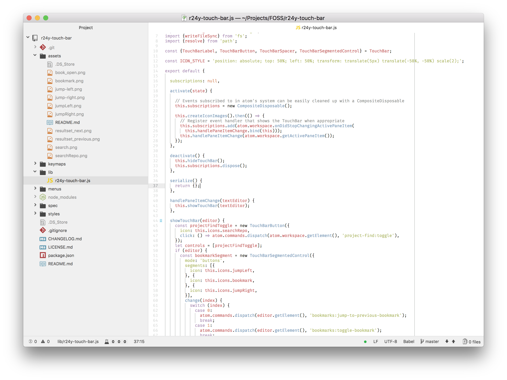

# r24y-touch-bar

Handy touch controls for Atom.

### Disclaimer

This is a work in progress; it may or may not be usable, and what I add might be useless for other folks. Some of it is super hacky, too; I wrote this in my spare time out of necessity, and didn't spend any particular amount of time on "getting it right".

  
  
  
<em>Left-to-right: Esc key (from MacOS), "Find in Project", "Select inside brackets", bookmarks (jump to previous, toggle, jump to next), and the buttons selected for "Control Strip" in Mac Preferences</em>

  
  
<em>Options for find/replace and Project Find are displayed when the appropriate panels are visible. Please note that this is a super hacky implementation and might break.</em>

----

Thanks to [@sindresorhus](https://github.com/sindresorhus/) for [Touch Bar Simulator](https://github.com/sindresorhus/touch-bar-simulator), which made it easy to take the screenshot of the Touch Bar.

## License

[MIT license](./LICENSE.md).
